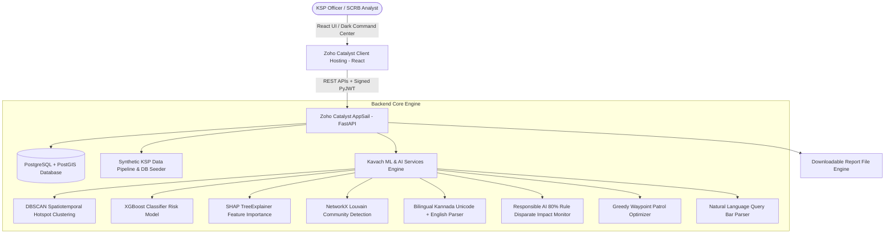

# Kavach (ಕವಚ) — Karnataka Police Crime Intelligence & Analytical Platform

> **State Crime Records Bureau (SCRB) Strategic Intelligence Hub**  
> *Built for Karnataka State Police (KSP)*

[](https://github.com/arjunvallala/Kavach/actions/workflows/ci.yml)
[](https://catalyst.zoho.com)
[](https://fastapi.tiangolo.com)
[](https://reactjs.org)
[](https://www.postgresql.org)
[](https://shap.readthedocs.io)

---

## 🔑 Demo Login Credentials (For Hackathon Judges)

The platform supports Role-Based Access Control (RBAC) with PyJWT token signing. Use any of the following credentials or the universal demo password:

| Role | Username | Dedicated Password | Universal Demo Password |
| :--- | :--- | :--- | :--- |
| **SCRB Director General (Admin)** | `admin` | `ksp_admin_2025` | `ksp_demo_2025` |
| **SCRB Analyst** | `analyst` | `ksp_analyst_2025` | `ksp_demo_2025` |
| **District SP** | `sp` | `ksp_sp_2025` | `ksp_demo_2025` |
| **Station House Officer (SHO)** | `sho` | `ksp_sho_2025` | `ksp_demo_2025` |
| **Constable** | `constable` | `ksp_constable_2025` | `ksp_demo_2025` |

---

## 📌 Executive Summary

**Kavach (ಕವಚ)** is a state-of-the-art, proactive Crime Intelligence & Analytical Platform engineered for the Karnataka State Police (KSP) and State Crime Records Bureau (SCRB). 

Kavach unifies state crime records into a database-backed AI strategic command center featuring **PostgreSQL + PostGIS persistence**, **spatiotemporal DBSCAN hotspot clustering**, **force-directed criminological graph analytics (Louvain community detection)**, **XGBoost risk scoring with real SHAP TreeExplainer feature attributions**, **bilingual (Kannada Unicode + English) FIR text mining**, **responsible AI 80%-rule fairness auditing**, **Hoysala patrol route optimization**, **persistent citizen tips**, and **direct report file exports**.

---

## ☁️ Zoho Catalyst Deployment Guide

Kavach is pre-configured for one-command deployment to **Zoho Catalyst**:
- **Backend Service**: Deployed via **Zoho Catalyst AppSail** (Python microservice).
- **Frontend Client**: Deployed via **Zoho Catalyst Client Hosting** (`frontend/dist`).

### Step-by-Step Deployment Instructions:

1. **Install Zoho Catalyst CLI** (if not already installed):
   ```bash
   npm install -g zcatalyst-cli
   ```

2. **Authenticate with Zoho Catalyst**:
   ```bash
   catalyst login
   ```

3. **Build the Frontend Dist Production Bundle**:
   ```bash
   cd frontend
   npm install
   npm run build
   cd ..
   ```

4. **Deploy to Zoho Catalyst Cloud**:
   ```bash
   catalyst deploy
   ```

5. Access your live production application link provided in the CLI output!

---

## 🎯 Problem to Solution Mapping (KSP Hackathon Requirements)

| KSP Problem Statement Requirement | Kavach Module & Verified Implementation |
| :--- | :--- |
| **Siloed, manual Excel records** | Persistent **PostgreSQL / PostGIS Database Store** with 5,500+ synthetic KSP FIR records & citizen tips across 10 Karnataka districts. |
| **Lack of SCRB-level proactive visibility** | **Executive Strategic Command Dashboard** querying database statistics for active gang counters and critical threat watchlists. |
| **Geospatial & Spatiotemporal Hotspot Detection** | **District → Station Drilldown GIS Map** querying DB records with time-of-day slider (00:00–23:00) and recalculating **DBSCAN clusters**. |
| **Emerging Trend Anomaly Alerts** | **Pulsing Red-Zone Alerts** calculating rolling z-score baseline deviations ($z \ge +1.2$). |
| **Criminal Link & Network Analysis** | **Force-Directed Graph Visualization** running real NetworkX **Louvain community detection** (`nx.community.louvain_communities`). |
| **Predictive Risk & Evidence-Grade AI** | **XGBoost Classifier Risk Watchlist** with real per-prediction **SHAP TreeExplainer** feature attribution vectors. |
| **Exportable Intelligence Reports** | **SCRB Intelligence Briefing Generator** exporting downloadable HTML/PDF briefing files via `/api/report/download`. |
| **Unstructured FIR Text Data** | **Bilingual (Kannada Unicode + English) NLP Parser** extracting weapons (`ಚಾಕು`), vehicles, stolen amounts, and IPC sections. |
| **Ethical AI & Over-Policing Risk** | **Bias & Fairness Audit Dashboard** computing dynamic overall fairness scores and Disparate Impact Ratios against the 80% Rule ($0.80 \le \text{Ratio} \le 1.25$). |
| **Actionable Operational Deployment** | **Hoysala Patrol Route Optimizer** generating waypoint sequences, time slots, and fuel estimates for station units. |
| **Community & Citizen Engagement** | **Anonymized Citizen Tip Layer** persisting tips directly to database tables, geo-fuzzed under DPDP Act 2023. |
| **Natural Language Accessibility** | **Multilingual Voice/Text Query Bar** translating query strings ("Show me theft hotspots in Mysuru") into JSON filters. |

---

## 🏗️ System Architecture



---

## 💻 Local & Docker Setup

### Option 1: Docker Compose (PostgreSQL + PostGIS + FastAPI + React)
```bash
docker-compose up --build
```
- **Frontend Dashboard**: `http://localhost:3000`
- **FastAPI OpenAPI Specs**: `http://localhost:8000/docs`

### Option 2: Local Python & Node Execution

**Backend & Pytest Suite:**
```bash
cd backend
pip install -r requirements.txt
pytest tests/
python main.py
```

**Frontend:**
```bash
cd frontend
npm install
npm run dev
```

---
*Developed for Karnataka State Police (KSP) / State Crime Records Bureau (SCRB).*
