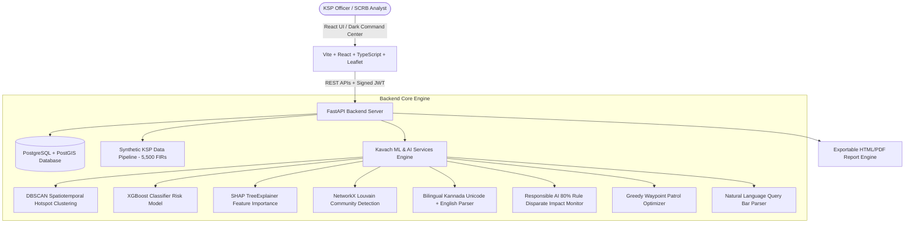

# Kavach (ಕವಚ) — Karnataka Police Crime Intelligence & Analytical Platform

> **State Crime Records Bureau (SCRB) Strategic Intelligence Hub**  
> *Built for Karnataka State Police (KSP)*

[](https://github.com/arjunvallala/Kavach/actions/workflows/ci.yml)
[](https://fastapi.tiangolo.com)
[](https://reactjs.org)
[](https://www.postgresql.org)
[](https://shap.readthedocs.io)

---

## 📌 Executive Summary

**Kavach (ಕವಚ)** is a state-of-the-art, proactive Crime Intelligence & Analytical Platform engineered for the Karnataka State Police (KSP) and State Crime Records Bureau (SCRB). 

Kavach unifies state crime records into an AI-powered strategic command center featuring **spatiotemporal DBSCAN hotspot clustering**, **force-directed criminological graph analytics (real Louvain community detection)**, **XGBoost risk scoring with real SHAP TreeExplainer feature attributions**, **bilingual (Kannada Unicode + English) FIR text mining**, **responsible AI 80%-rule fairness auditing**, **Hoysala patrol route optimization**, and **anonymized citizen tip intelligence**.

---

## 🎯 Problem to Solution Mapping (KSP Hackathon Requirements)

| KSP Problem Statement Requirement | Kavach Module & Verified Implementation |
| :--- | :--- |
| **Siloed, manual Excel records** | Unified REST API & PostgreSQL/PostGIS store with 5,500+ synthetic KSP FIR records across 10 Karnataka districts. |
| **Lack of SCRB-level proactive visibility** | **Executive Strategic Command Dashboard** with real-time state metrics, active gang counters, and critical threat watchlists. |
| **Geospatial & Spatiotemporal Hotspot Detection** | **District → Station Drilldown GIS Map** with time-of-day slider (00:00–23:00) and recalculating **DBSCAN clusters**. |
| **Emerging Trend Anomaly Alerts** | **Pulsing Red-Zone Alerts** calculating rolling z-score baseline deviations ($z \ge +1.2$). |
| **Criminal Link & Network Analysis** | **Force-Directed Graph Visualization** running real NetworkX **Louvain community detection** (`nx.community.louvain_communities`). |
| **Predictive Risk & Evidence-Grade AI** | **XGBoost Classifier Risk Watchlist** with real per-prediction **SHAP TreeExplainer** feature attribution vectors. |
| **Exportable Intelligence Reports** | **SCRB Intelligence Briefing Generator** exporting printable/downloadable HTML/PDF briefing documents. |
| **Unstructured FIR Text Data** | **Bilingual (Kannada Unicode + English) NLP Parser** extracting weapons, vehicles, stolen amounts, and IPC sections. |
| **Ethical AI & Over-Policing Risk** | **Bias & Fairness Audit Dashboard** computing dynamic Disparate Impact Ratios against the 80% Rule ($0.80 \le \text{Ratio} \le 1.25$). |
| **Actionable Operational Deployment** | **Hoysala Patrol Route Optimizer** generating waypoint sequences, time slots, and fuel estimates for station units. |
| **Community & Citizen Engagement** | **Anonymized Citizen Tip Layer** geo-fuzzed for privacy compliance under DPDP Act 2023. |
| **Natural Language Accessibility** | **Multilingual Voice/Text Query Bar** translating query strings ("Show me theft hotspots in Mysuru") into JSON filters. |

---

## 🏗️ System Architecture



---

## 💡 What's Novel (Hackathon Differentiators)

1. **Real SHAP TreeExplainer Explainability**: Removes "black-box" AI concerns by giving court-admissible feature attribution breakdowns ($\phi_i$) for every XGBoost risk prediction.
2. **Bilingual (Kannada Unicode + English) FIR Text Mining**: Directly attacks the unstructured narrative problem by extracting structured entities (weapons, vehicles, MO tags) from mixed Kannada script (`ಸರ ಕಳವು`, `ಚಾಕು`, `ಗಾಂಜಾ`) and English text.
3. **Built-in 80% Rule Bias & Fairness Audit**: Ensures ethical compliance by continuously calculating Disparate Impact Ratios ($0.80 \le \text{Ratio} \le 1.25$) dynamically across districts to prevent feedback-loop over-policing.
4. **Actionable Patrol Optimization**: Converts abstract predictive risk scores into concrete Hoysala patrol vehicle waypoints and time slots.
5. **DPDP 2023 Compliant Citizen Tip Layer**: Incorporates crowdsourced community tips that are automatically geo-fuzzed to protect citizen anonymity.
6. **JWT Role-Based Auth Guard & Security**: Signed JWT access tokens with role claims, CORS domain restrictions, and FastAPI dependency guards.

---

## 🚀 2-Minute Judge Demo Script

1. **0:00 – 0:30 (Command Center & Hotspots)**:
   - Open Kavach dashboard (`http://localhost:3000`). Show the dark SCRB Command Center theme.
   - Point to the live **Executive Overview** cards showing 5,500 analyzed FIRs and active red zones.
   - Switch to **Geospatial Intelligence**. Drag the **Time-of-Day Slider** from 18:00 to 23:00 to watch DBSCAN clusters dynamically recalculate and highlight the pulsing **Red-Zone Alert** in Peenya PS ($z = +2.4$).
2. **0:30 – 1:00 (Network Graph & Criminal Rings)**:
   - Click **Network & Link Analysis**. Hover over the force graph to showcase offender co-accused links.
   - Highlight **Garuda Syndicate (RING-KSP-101)** automatically surfaced by the Louvain community detection algorithm (`nx.community.louvain_communities`). Click a node to view the MO similarity score (92.4% match).
3. **1:00 – 1:30 (Predictive Risk & SHAP Explainability)**:
   - Click **AI Risk & SHAP Explainability**. Show the 7-day risk watchlist ranking stations by risk score.
   - Click **Peenya PS (Risk: 88/100)** to reveal the SHAP bar chart showing exact feature attributions (*Historical Density +0.38, Unemployment Rate +0.24*).
4. **1:30 – 2:00 (Bilingual NLP & Intelligence Briefing)**:
   - Switch to **SCRB Innovation Suite** -> **Bilingual FIR NLP Mining**. Select a Kannada/English sample narrative and click **Extract Entities** to show extracted weapons (Knife/ಚಾಕು), vehicle (Pulsar 220), and IPC section 392.
   - Click **Export Briefing** in the header to preview the printable KSP SCRB Intelligence Report document.

---

## 📊 5-Slide Pitch Outline

- **Slide 1: The Problem**: KSP crime records are siloed in Excel spreadsheets, strictly reactive, with zero cross-jurisdiction link visibility or automated hotspot forecasting.
- **Slide 2: The Solution (Kavach)**: A unified, AI-driven SCRB Strategic Intelligence Platform offering geospatial hotspots, link analysis, predictive risk scoring, and bilingual NLP text mining.
- **Slide 3: Architecture & Data Pipeline**: Powered by React/TypeScript frontend, FastAPI backend, PostgreSQL + PostGIS, DBSCAN clustering, XGBoost risk models, SHAP TreeExplainer, and NetworkX Louvain graph analytics.
- **Slide 4: Key Differentiators**: Bilingual Kannada/English FIR entity extraction, SHAP evidence-grade explainability, Responsible AI 80% Rule fairness audit dashboard, and Hoysala patrol route optimization.
- **Slide 5: Impact & Future Roadmap**: Transforms KSP from reactive policing to proactive intelligence; ready for live KSP CCTNS integration and state-wide rollout.

---

## 💻 Local One-Command Setup

### Option 1: Docker Compose (PostgreSQL + PostGIS + FastAPI + React)
```bash
docker-compose up --build
```
- **Frontend Dashboard**: `http://localhost:3000`
- **FastAPI OpenAPI Specs**: `http://localhost:8000/docs`

### Option 2: Local Python & Node Execution

**Backend & Pytest Suite:**
```bash
cd backend
pip install -r requirements.txt
pytest tests/
python main.py
```

**Frontend:**
```bash
cd frontend
npm install
npm run dev
```

---
*Developed for Karnataka State Police (KSP) / State Crime Records Bureau (SCRB).*
